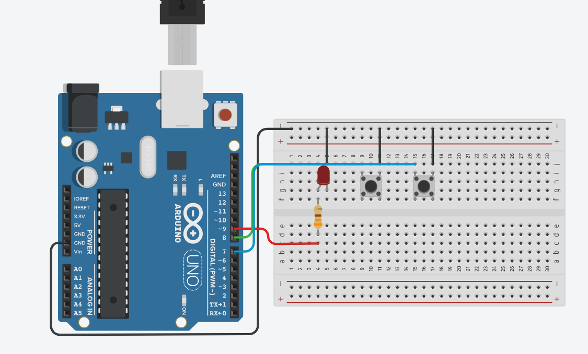

# Push-Button Dimmable LED
A hardware automation project that utilizes discrete digital inputs from push-buttons to dynamically scale and increment PWM voltage levels, allowing real-time brightness control of an LED.

>Built while following [Paul McWhorter's Arduino Tutorials](https://www.youtube.com/playlist?list=PLGs0VKk2DiYw-L-RibttcvK-WBZm8WLEP) series
---
## Demo

---
## How It Works
The system utilizes two push-buttons configured with internal pull-up resistors, meaning their resting state reads as `HIGH` (`1`). When a button is physically pressed, it connects the pin to ground, bringing the state down to `LOW` (`0`).

The Arduino continuously samples these digital states using `digitalRead()`. Inside the execution `loop()`, conditional checks determine the behavior:

* If buttonPin1 reads 0, the brightness variable increments by 1.

* If buttonPin2 reads 0, the brightness variable decrements by 1.

To ensure the value never exceeds hardware limits, the mathematical value is bounded via `constrain(brightness, 0, 254)`. Finally, this value is translated into a duty cycle and outputted to a PWM-capable pin via `analogWrite()`, altering the average voltage driving the LED. Real-time logging is outputted directly to the `Serial Monitor` for hardware tracking.

---
## Circuit

## Components
* Arduino Uno
* 1x red LED
* 2x Push-Buttons
* Bread Board + Jumper Wires

---
## Concepts Covered
**Pulse Width Modulation (PWM):** Simulating analog voltage ranges using `analogWrite().`

**Pull-Up Logic:** Handling inverted input signals where an active button press equals a `0 state`.

**Data Constraints:** Using `constrain()` to prevent code variables from exceeding bounds.

**Serial Telemetry:** Streaming live hardware variables back to the computer.

---
## Skills
`Arduino` `C++` `Data Scaling` `State Management`
